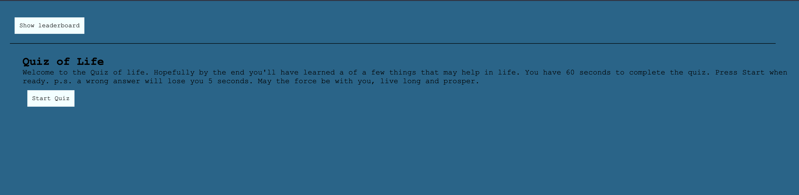

# bookish-gambino
JavaScript quiz webapp
## Table of Contents

* [Description](#description)
* [Links](#links)
* [Purpose](#purpose)
* [Screenshots](#screenshots)
* [Technologies Used](#technologies)
* [Licence](#license)
* [Credits](#credits)
## Description

This is a javascript based example quiz with Highscore board using local storage

## Links
https://crisesaverting.github.io/bookish-gambino/

## Purpose

This repository contains an example quiz using javascript

## Screenshots

## Technologies

## License

## Credits
Some of these materials were developed by the 2U/edX Coding Curriculum Team for use with bootcamp students.